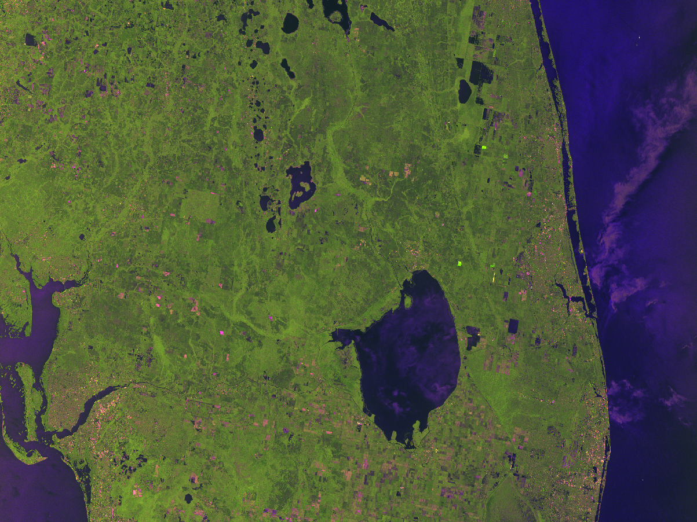

# Soil Moisture from Synthetic Aperture Radar

Project completed through UF Women in Computer Science and Engineering (WiCSE)'s Shadowing Program with Terraview in Spring 2025.

Developing a workflow to automatically retrieve and process synthetic aperture radar (SAR) imagery to generate accurate soil moisture data.

## Code Structure
The "PreviousWork" folder includes [work by previous program participants](https://github.com/keerthanachinthala/WiCSE_SAR_project).

The "ProcessData" folder includes our work to implement image processing and soil calculation in Python.

1. Setup

Import the libraries and APIs we will use and manually defining our area of interest and file paths for input and output. The user can edit the area of interest and file paths. There is a requirements.txt file to allow users to install all libraries efficiently.

2. Retrieving data

Retrieve necessary data files: synthetic aperture radar (SAR) from Copernicus Data Space Ecosystem and Microsoft’s Planetary Computer, digital elevation model (DEM), and Soil Moisture Active Passive (SMAP) from NASA’s database through earth access.

3. Processing data

Apply Thermal Noise Removal, Radiometric Calibration, Speckle Filtering, and Terrain Correction (Radiometric and Geometric). We used the previous WiCSE shadowing work, SNAP documentation, research reports, and open source software to inform our process.

4. Estimating Soil Moisture

We drew inspiration from the previous WiCSE shadowing work and multiple research reports regarding soil moisture estimation. We decided on using a regression model to estimate soil moisture through backscatter analysis and soil moisture data from SMAP.